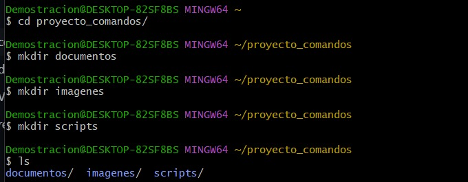
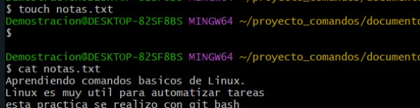
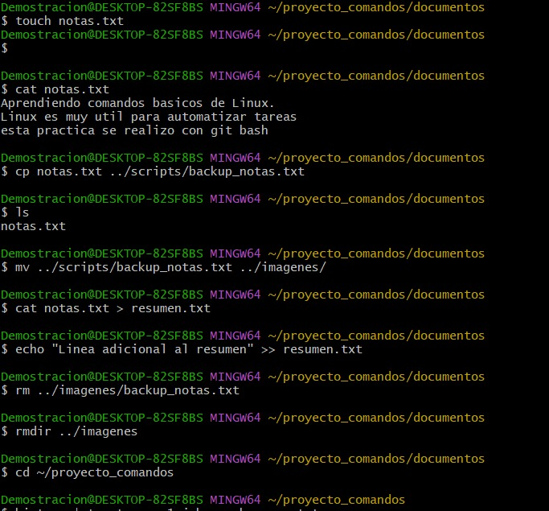

# Informe Práctica No. 1 – Comandos de Linux

## 1. Título  
**Manipulación de Archivos y Directorios en Linux con Comandos Básicos**

## 2. Tiempo de duración  
Duración aproximada: 60 minutos

## 3. Fundamentos  

Linux es un sistema operativo ampliamente utilizado en servidores, sistemas embebidos y equipos de escritorio. Su potencia radica en la terminal, donde los usuarios pueden ejecutar comandos para administrar el sistema de forma eficiente. En esta práctica se trabajó con comandos de manipulación de archivos y directorios, redirección de contenido y organización de la estructura de carpetas.

A través del uso de comandos como `mkdir`, `touch`, `echo`, `cp`, `mv`, `rm`, `cat` y `>>`, se realizó una simulación del manejo de archivos dentro de un proyecto. Estos comandos permiten al usuario realizar tareas básicas como crear carpetas, generar archivos, copiar contenido, mover archivos entre carpetas y eliminar información innecesaria. Además, se aplicaron conceptos de redirección de salida (`>`, `>>`) para crear y actualizar archivos de texto con contenido generado desde otros archivos o líneas ingresadas directamente en la terminal.

El conocimiento y dominio de estos comandos son fundamentales para desenvolverse en entornos Linux, ya que muchas tareas administrativas, de desarrollo y automatización se basan en estas operaciones.

> 📌 **Imagen sugerida**:  
>   
> *Figura 1-1. Estructura creada durante la práctica.*

## 4. Conocimientos previos  

Para realizar esta práctica, el estudiante necesita tener conocimiento en:

- Comandos básicos de Linux (mkdir, touch, echo, cp, mv, rm, cat)
- Uso de la terminal o consola (Git Bash, WSL, Ubuntu Terminal)
- Editores de texto en terminal como `nano` o `vim`
- Manejo de rutas relativas y absolutas en el sistema de archivos

## 5. Objetivos a alcanzar  

- Implementar una estructura básica de carpetas en un entorno Linux  
- Manipular archivos de texto mediante comandos en terminal  
- Aplicar redirección y concatenación de contenidos  
- Gestionar archivos y carpetas mediante comandos de eliminación y movimiento

## 6. Equipo necesario  

- Computador con sistema operativo Windows, Linux o MacOS  
- Acceso a un terminal Bash (Git Bash, Ubuntu WSL o similar)  
- Editor de texto en terminal (`nano`, `vim` o similar)  
- Conexión a internet para subir el repositorio a GitHub  
- Cuenta de GitHub para alojar el informe y los archivos

## 7. Material de apoyo  

- Documentación oficial de comandos Linux: https://linux.die.net/  
- Guía de la asignatura  
- Cheat sheet de comandos Linux: https://education.github.com/git-cheat-sheet-education.pdf  
- Plantilla de informe: https://github.com/maguaman2/informe-tendencias

## 8. Procedimiento  

### Paso 1: Crear la carpeta principal y subcarpetas  
mkdir -p proyecto_comandos/documentos proyecto_comandos/imagenes proyecto_comandos/scripts

### Paso 2: Crear archivo notas.txt y agregar contenido

### Paso 3: Copiar y renombrar el archivo
### Paso 4: Mover el archivo a la carpeta imagenes
### Paso 5: Crear resumen.txt y redirigir contenido bash Copiar Editar
### Paso 6: Eliminar archivo y carpeta
### Paso 7: Guardar historial en archivo

## 9. Resultados esperados
Estructura de carpetas correctamente creada

Archivos manipulados exitosamente

Archivo de historial generado con el resumen de comandos utilizados

Repositorio en GitHub con informe en formato Markdown

Archivo de audio explicando lo aprendido en la práctica

### 10. Bibliografía
Torres, A. (2020). Comandos básicos de Linux. Linux Academy.
González, M. (2022). Guía práctica de administración en Linux. Ediciones Open Source.
The Linux Documentation Project. (2021). Linux Command-Line Tools Summary. https://tldp.org